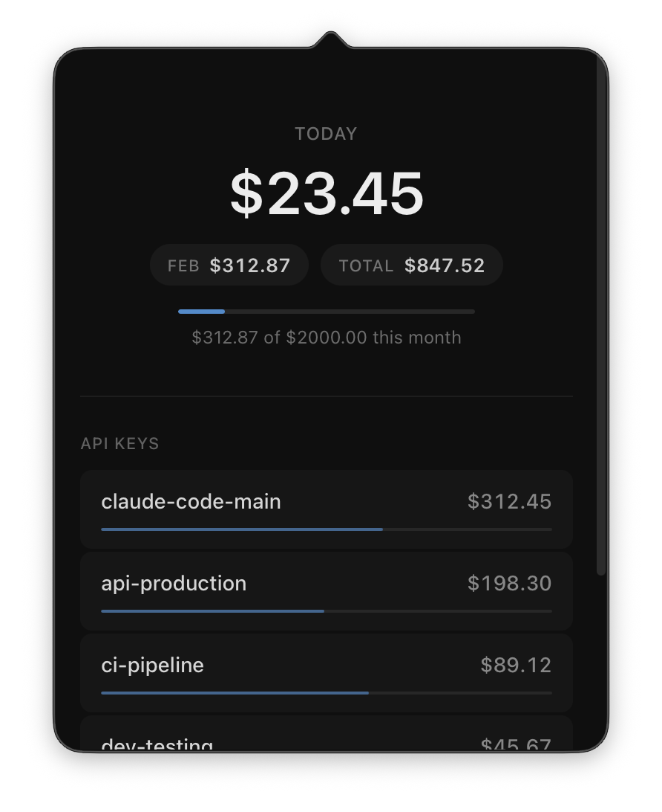

# LiteLLM Usage

A lightweight macOS menu bar app to monitor your LiteLLM proxy usage and spending.



## Features

- Menu bar app with popover interface
- View total spend and budget
- Daily and monthly spend tracking
- Per-key usage breakdown
- Auto-refreshes when opened

## Installation

Download the latest `.dmg` from [Releases](../../releases) or build from source.

## Configuration

The app reads your LiteLLM API credentials from multiple locations (in priority order):

| Location | Description |
|----------|-------------|
| `~/.claude/settings.local.json` | Local overrides (highest priority) |
| `~/.claude/settings.json` | Claude Code settings |
| `~/.litellm/config.json` | LiteLLM config |
| `~/.config/litellm-usage/config.json` | App-specific config |

### Supported environment variable names

**Base URL:**
- `ANTHROPIC_BASE_URL`
- `LITELLM_BASE_URL`
- `API_BASE_URL`

**API Token:**
- `ANTHROPIC_AUTH_TOKEN` / `ANTHROPIC_API_TOKEN` / `ANTHROPIC_API_KEY`
- `LITELLM_AUTH_TOKEN` / `LITELLM_API_TOKEN` / `LITELLM_API_KEY`
- `API_TOKEN` / `API_KEY`

### Example configuration

Add to `~/.claude/settings.json`:

```json
{
  "env": {
    "ANTHROPIC_BASE_URL": "https://your-litellm-proxy.com",
    "ANTHROPIC_AUTH_TOKEN": "sk-your-api-key"
  }
}
```

## Development

### Prerequisites

- [Node.js](https://nodejs.org/) (v18+)
- [pnpm](https://pnpm.io/)
- [Rust](https://rustup.rs/)

### Setup

```bash
# Install dependencies
pnpm install

# Run in development mode
pnpm tauri dev

# Type check
pnpm check
```

### Building

```bash
# Build for production
pnpm tauri build

# Build universal macOS binary with code signing
./scripts/build-macos.sh

# Build with notarization
./scripts/build-macos.sh --notarize
```

For code signing and notarization, copy `.env.example` to `.env` and fill in your Apple Developer credentials.

## Tech Stack

- **Frontend:** SvelteKit 2 + Svelte 5 + TypeScript
- **Backend:** Rust + Tauri v2
- **Package Manager:** pnpm

## License

MIT
